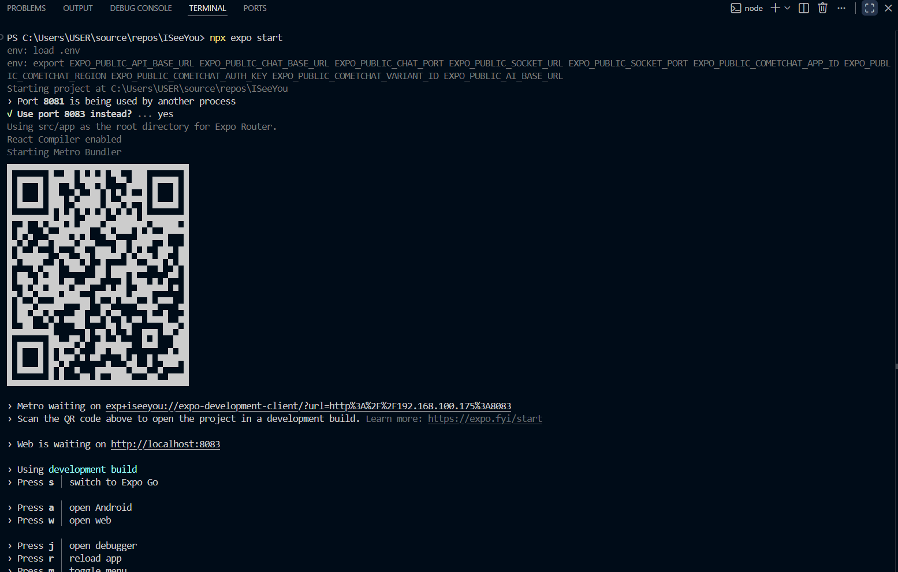
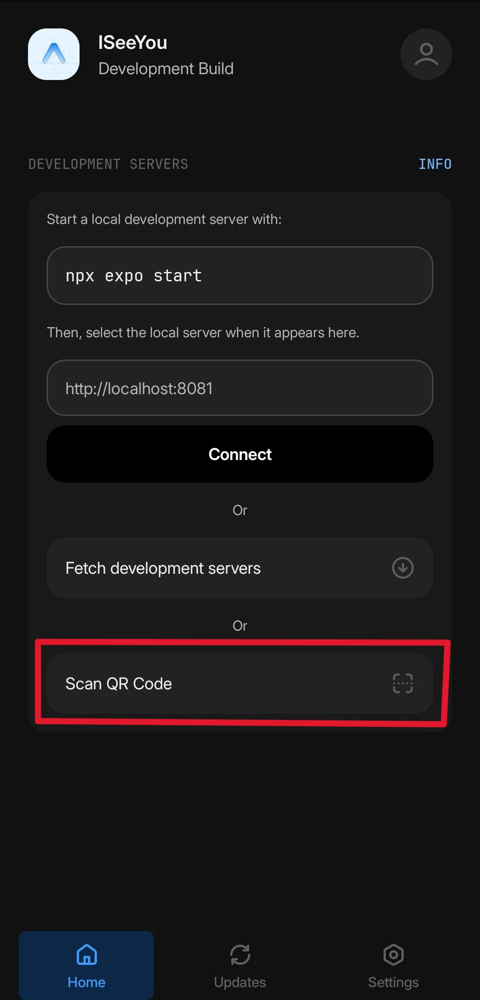

# ISeeYou - Fortune Telling App

<div align="center">

**Modern application with video calling, real-time chat, and AI features.**

[Features](#-features) • [Tech Stack](#-tech-stack) • [Getting Started](#-getting-started) • [Architecture](#-architecture) • [Development](#-development)

</div>

---

## Overview

**ISeeYou** is a fortune telling platform built with React Native and Expo, connecting users with professional consulting seers. The application includes:

- **Video Calling** for live consulting sessions
- **Real-Time Chat** integrated with the booking system
- **AI Assistant** for instant consultation support
- **Service Package Management** and discovery
- **Secure Authentication** with automatic token refresh
- **Push Notifications** via Firebase
- **Payment System** with transaction history
- **Expert Profiles** with certificates and performance statistics

---

## Features

### For Users
- 🔍 Search and discover service packages and seers
- 📞 Schedule video consultation calls
- 💬 Real-time chat with seers
- 🤖 AI-powered chat assistant support
- ❤️ Favorites system and reviews
- 📊 Transaction history and payment methods (PayPal, VNPAY, Bank Transfer)
- 🔔 Push notifications for bookings and messages

### For Seers
- 📦 Create and manage service packages
- 📋 Manage certificates and qualifications
- 📈 Performance statistics and salary history
- 🎯 Analyze potential customers
- 💰 Track payments and income

---

## Tech Stack

### Frontend Development Framework
- **React Native** 0.81.4 - Framework for multi-platform mobile app development
- **Expo** 54.0.10 - Development platform and tools
- **Expo Router** 6.0.8 - File-based routing (similar to Next.js)
- **React Navigation** 7.1.17 - Navigation management

### UI & Styling
- **React Native Paper** - Material Design component library
- **Tailwind CSS** (via Prettier plugin) - Utility-first CSS
- **Lucide React Native** - Icon library
- **Expo Linear Gradient** - Gradient backgrounds

### State Management & Data
- **TanStack React Query** 5.90.6 - Server state management
- **AsyncStorage** - Local session storage
- **SecureStore** (expo-secure-store) - Encrypted storage for sensitive data

### Real-Time Communication
- **CometChat UI Kit** 5.2.3 - Chat and video call SDK
  - CometChat Chat SDK 4.0.16
  - CometChat Calls SDK 4.4.0
- **Socket.IO** - Real-time events via WebSocket

### Integration of Backend
- **Axios** 1.12.2 - HTTP client with interceptors
- Three-service architecture:
  - **API Gateway** (port 8080) - Authentication, bookings, users, service packages
  - **Chat Service** (port 8081) - Messaging and WebSocket
  - **Socket Service** (port 8082) - Real-time events

### Authentication & Security
- **Firebase Authentication** - Push notifications
- **JWT Token Management** - Automatic refresh with request queueing
- **Secure Storage** - Protected credential storage

### Development Tools
- **TypeScript** - Type checking
- **ESLint** - Code quality (Expo flat config)
- **Prettier** - Code formatting
- **React DevTools** - Debugging
- **Expo Application Services (EAS)** - Build and submit apps

---

## Getting Started

### Prerequisities
- **ISeeYou Backend** (visit https://github.com/ISeeYou-Fortune-Telling-App/ISU-Backend-Production for installation instructions)
- **Node.js** 16+ and npm
- **Git**
- **Expo CLI** (install via `npm install --global expo-cli` or use npx)
- Optional: **Android Studio** (for Android emulator) or **Xcode** (for iOS simulator)

### Installation

1. **Clone the repository**
   ```bash
   git clone <repository-url>
   cd ISeeYou
   ```

2. **Install dependencies**
   ```bash
   npm install
   ```

3. **Configure environment variables**
   
   The project includes `.env.example` as a sample file. You can rename it to `.env` and then replace `localhost` with your host's IPv4 address(which you can obtain via running the command `ipconfig`), or create `.env` manually:

   ```bash
   # Replace 'localhost' with your host's IPv4 address
   EXPO_PUBLIC_API_BASE_URL=http://localhost:8080
   EXPO_PUBLIC_AI_BASE_URL=http://localhost:8081
   EXPO_PUBLIC_CHAT_BASE_URL=http://localhost:8081
   EXPO_PUBLIC_CHAT_PORT=8081
   EXPO_PUBLIC_SOCKET_URL=http://localhost:8082
   EXPO_PUBLIC_SOCKET_PORT=8082
   
   # CometChat Configuration
   EXPO_PUBLIC_COMETCHAT_APP_ID=167166294e6dd0180
   EXPO_PUBLIC_COMETCHAT_REGION=us
   EXPO_PUBLIC_COMETCHAT_AUTH_KEY=69eb85b8b28dbd77670ea910c6f54d4b4faeb92d
   EXPO_PUBLIC_COMETCHAT_VARIANT_ID=691ad6bc5c867ddb852c140e
   ```
   > **Note:** On Android emulators, `scripts/update-local-ip.js` automatically converts `localhost` → `10.0.2.2` (Android VM gateway)

4. **Download & install the app (Android)**
   - Go to our Git: https://github.com/ISeeYou-Fortune-Telling-App/ISU-FrontEnd-App
   - Under the "Releases" section, look for "ISeeYou EAS Build"
   - Download the apk file (ISeeYou_v0.1_dev.apk)
   - Install on your device

### Running the App

#### Development Server (Terminal)
```bash
npx expo start
```
Your terminal should look something like this:


Then:
- open the app on your device
- click on "Scan QR Code"

- and scan the QR code that appears in your terminal.

#### Android Emulator
```bash
npm run android
```
Automatically runs environment setup and opens Android emulator.

#### iOS Simulator
```bash
npm run ios
```
Requires macOS. Automatically runs environment setup and opens iOS simulator.

---

## Architecture

### Three-Service Architecture

```
┌─────────────────────────────────────────────────────┐
│ Mobile App (React Native) + Web (Expo Router)       │
└────────────────────┬────────────────────────────────┘
                     │
        ┌────────────┼────────────┐
        │            │            │
        ▼            ▼            ▼
   API Gateway   Chat Service  Socket Service
   (port 8080)   (port 8081)   (port 8082)
   /core/**      /chat/**      WebSocket
                 /admin/**     socket.io
```

### Authentication Flow
```
1. Login → API.post('/core/auth/login')
2. Response: { token, refreshToken, userId, role, cometChatUid }
3. Store in SecureStore (authToken, refreshToken, userRole, userId, cometChatUid)
4. Initialize CometChat user via bootstrapCometChatUser()
5. Request interceptor automatically adds: Authorization: Bearer {token}
6. On 401: Refresh token → Queue pending requests → Retry
```

### Directory Structure
```
src/
├── app/                    # Expo Router pages (file-based routing)
│   ├── _layout.tsx         # Root layout, CometChat init, auth handling
│   ├── (tabs)/             # Tab bar screens
│   └── auth.tsx, chat.tsx, etc.
├── screens/                # Screen components (imported by routes)
├── services/               # API services
│   ├── api.js              # Axios instances + interceptors
│   ├── cometchat.ts        # CometChat initialization
│   ├── aiChat.ts           # AI chat SSE streaming
│   └── ...
├── contexts/               # React Context providers
│   └── CallContext.tsx     # Video call state management
├── components/             # Reusable UI components
├── constants/              # Colors, themes, constants
├── hooks/                  # Custom React hooks
├── utils/                  # Utility functions
├── types/                  # TypeScript type definitions
└── polyfills/              # Polyfills (NativeEventEmitter)
```

### Key Patterns

#### Request Interceptor
```typescript
// Automatically add auth token to requests
headers.Authorization = `Bearer ${authToken}`;

// Skip auth for public endpoints
if (config.skipAuth) delete headers.Authorization;
```

#### Response Interceptor
```typescript
// On 401: Refresh token and retry
if (error.response.status === 401) {
  // 1. Refresh token via /core/auth/refresh
  // 2. Queue pending requests
  // 3. Retry with new token
}
```

#### CometChat Initialization
```typescript
// 1. Initialize early in _layout.tsx (non-blocking, survives Fast Refresh)
initCometChat()

// 2. On successful login: Bootstrap user
bootstrapCometChatUser(userId, cometChatUid)

// 3. CallProvider wraps entire app for call state management
```

---

## Development

### Available Scripts

```bash
# Start development server (interactive menu)
npm start

# Run on Android emulator
npm run android

# Run on iOS simulator (macOS only)
npm run ios

# Run web version
npm run web

# Run ESLint
npm run lint

# Reset project to initial state
npm run reset-project
```

### Building for Release

#### Development Build
```bash
eas build --platform android|ios --profile development
```

#### Production Build (auto-increments version)
```bash
eas build --profile production
```

#### Submit to App Stores
```bash
eas submit --platform android|ios --profile production
```

### Code Quality

- **TypeScript** - Strict mode enabled for all files
- **ESLint** - Enforces code standards (Expo flat config)
- **No implicit `any`** - Use explicit types or generics
- **Base path alias** `@/*` - Maps to project root

### Debugging Tips

| Issue | Solution |
|-------|----------|
| CometChat init fails | Check `EXPO_PUBLIC_COMETCHAT_*` in `.env` and `app.json` |
| Network timeout | Verify `.env` URLs match backend services (gateway, chat, socket) |
| Token refresh loop | Check `/core/auth/refresh` response; ensure `token` field exists |
| Call state stuck | Check `CallContext` via React DevTools; verify listeners registered |
| Health check warnings | Run `runRealtimeSelfCheck()` in console for diagnostics |

---

## Environment Variables Reference

| Variable | Purpose | Example |
|----------|---------|---------|
| `EXPO_PUBLIC_API_BASE_URL` | Core API gateway | `http://192.168.1.4:8080` |
| `EXPO_PUBLIC_CHAT_BASE_URL` | Chat service with WebSocket | `http://192.168.1.4:8081` |
| `EXPO_PUBLIC_AI_BASE_URL` | AI chat SSE streaming | `http://192.168.1.4:8081` |
| `EXPO_PUBLIC_SOCKET_PORT` | Socket.io port | `8082` |
| `EXPO_PUBLIC_SOCKET_URL` | Socket.io full URL | `http://192.168.1.4:8082` |
| `EXPO_PUBLIC_COMETCHAT_APP_ID` | CometChat app identifier | (from CometChat dashboard) |
| `EXPO_PUBLIC_COMETCHAT_REGION` | CometChat region | `us`, `eu`, `in` |
| `EXPO_PUBLIC_COMETCHAT_AUTH_KEY` | CometChat authentication | (from CometChat dashboard) |
| `EXPO_PUBLIC_COMETCHAT_VARIANT_ID` | CometChat variant | (from CometChat dashboard) |

> **Auto-Update Note:** `scripts/update-local-ip.js` automatically updates `EXPO_PUBLIC_*_BASE_URL` variables whenever you run `npm start`, `npm run android`, `npm run ios`, or `npm run web` with your machine's local IP address.

---

## Main Modules

### Services
- **`api.js`** - Axios instances for API Gateway and Chat Service
- **`cometchat.ts`** - CometChat SDK initialization and user bootstrap
- **`aiChat.ts`** - AI chat streaming via Server-Sent Events (SSE)

### Contexts
- **`CallContext.tsx`** - Manage video call state (idle → connecting → inCall → ended)

### Utilities
- Token refresh with request queueing
- FormData helpers for multipart uploads
- Date/time formatting with dayjs

---

## Status Enums & Payment Methods

### Booking Status
- `PENDING` - Awaiting confirmation
- `CONFIRMED` - Confirmed by expert
- `COMPLETED` - Session completed
- `CANCELED` - Canceled by user or expert
- `FAILED` - Payment or system error

### Payment Methods
- `PAYPAL` - Recommended method
- `VNPAY` - Vietnam payment gateway
- `BANK_TRANSFER` - Direct bank transfer

---

## Support & Contact

To report bugs, ask questions, or contribute:
- Check [Copilot Instructions](./.github/copilot-instructions.md) for architecture details
- See [Expo Documentation](https://docs.expo.dev/) for framework-specific questions
- Check [CometChat Documentation](https://www.cometchat.com/docs/) for real-time features

---

## Our Team

- 23520540 - Tăng Minh Hoàng
- 23520582 - Võ Phi Hùng
- 23520975 - Nguyễn Đình Hoài Nam

---

**Last Updated:** December 2025 | Expo 54.0 | React Native 0.81 | React 19
